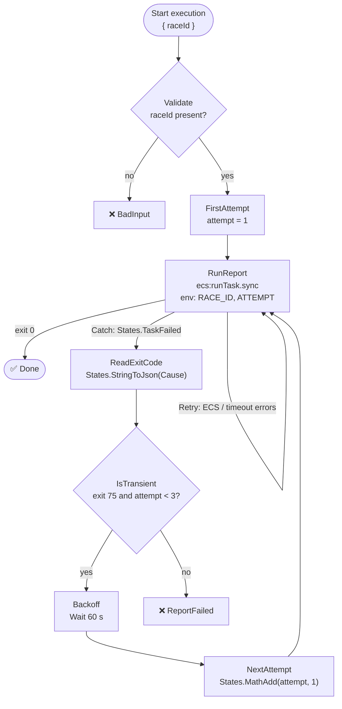

<div align="center">

# 🚀 csharp-fargate-stepfunctions

**A C# console app that runs as a short-lived AWS Fargate task, orchestrated by Step Functions, where the container's exit code decides what happens next.**

[](https://github.com/atonyhonesto/csharp-fargate-stepfunctions/actions/workflows/ci.yml)


Companion code for my LinkedIn article<br>
**[Deploying a C# Console Application to AWS Fargate →](https://www.linkedin.com/pulse/deploying-c-console-application-aws-fargate-tony-honesto-yejac/)**

</div>

---

## Why a console app on Fargate

Lambda is great until a job needs more than 15 minutes, more memory, a big dependency, or just an existing .NET console app. Fargate runs the container with no servers to manage and bills per second, and Step Functions starts it, waits for it (`ecs:runTask.sync`), and decides what to do with the result. The contract between them is small: **environment variables in, structured logs and an exit code out.**



| Exit code | Meaning | State machine does |
|---|---|---|
| `0` | Report written | Succeed |
| `2` | Bad input: missing race ID, no data, malformed file | Fail now: retrying can't fix it |
| `75` | `EX_TEMPFAIL`: dependency down, or stopped by SIGTERM mid-job | Wait, then run again (up to 3 attempts) |

## Run it

```bash
git clone https://github.com/atonyhonesto/csharp-fargate-stepfunctions.git
cd csharp-fargate-stepfunctions
dotnet test                                   # job logic, exit codes, and the state machine
dotnet run --project src/Simulator            # walk the ASL through five scenarios
./container-check.sh                          # build the image and run it like Fargate does
```

### The state machine, walked through five situations

`src/Simulator` interprets [`infra/state-machine.asl.json`](infra/state-machine.asl.json) and runs **the real job code** for every ECS task, so the workflow's branching is tested without an AWS account. Real output from CI:

```text
clean run
  path       Validate > FirstAttempt > RunReport > Done
  exit codes 0
  result     SUCCEEDED

  job log (JSON lines, as CloudWatch would receive them):
    {"ts":"2026-10-08T11:12:38.0239122+00:00","level":"info","message":"job started","data":{"raceId":"indy-2026","attempt":1,"taskArn":"local"}}
    {"ts":"2026-10-08T11:12:38.0713631+00:00","level":"info","message":"car","data":{"car":"24","best":"0:40.407","bestLapNumber":1,"pitLaps":1}}
    {"ts":"2026-10-08T11:12:38.0726417+00:00","level":"info","message":"car","data":{"car":"5","best":"0:40.592","bestLapNumber":1,"pitLaps":0}}
    {"ts":"2026-10-08T11:12:38.0726560+00:00","level":"info","message":"car","data":{"car":"77","best":"0:40.762","bestLapNumber":24,"pitLaps":1}}
    {"ts":"2026-10-08T11:12:38.0726661+00:00","level":"info","message":"car","data":{"car":"48","best":"0:41.050","bestLapNumber":11,"pitLaps":0}}
    {"ts":"2026-10-08T11:12:38.0727793+00:00","level":"info","message":"job finished","data":{"outFile":"/tmp/lap-report-28a3bca5c41647b8ada37bd3934c76e1/indy-2026-summary.json","fastestCar":"24","laps":120}}

dependency down for 2 attempts
  path       Validate > FirstAttempt > RunReport > ReadExitCode > IsTransient > Backoff > NextAttempt > RunReport > ReadExitCode > IsTransient > Backoff > NextAttempt > RunReport > Done
  exit codes 75, 75, 0
  result     SUCCEEDED

dependency still down
  path       Validate > FirstAttempt > RunReport > ReadExitCode > IsTransient > Backoff > NextAttempt > RunReport > ReadExitCode > IsTransient > Backoff > NextAttempt > RunReport > ReadExitCode > IsTransient > ReportFailed
  exit codes 75, 75, 75
  result     FAILED (LapReportFailed)

race with no data
  path       Validate > FirstAttempt > RunReport > ReadExitCode > IsTransient > ReportFailed
  exit codes 2
  result     FAILED (LapReportFailed)

execution started without raceId
  path       Validate > BadInput
  exit codes (no task started)
  result     FAILED (BadInput)
```

### The container, run the way Fargate runs it

Read-only root filesystem, `/tmp` as scratch, configuration from environment variables, and a real `docker stop` to send SIGTERM. Real output from CI:

```text
built lap-report:ci

== RACE_ID=indy-2026
{"ts":"2026-10-08T11:12:57.3501179+00:00","level":"info","message":"car","data":{"car":"48","best":"0:41.050","bestLapNumber":11,"pitLaps":0}}
{"ts":"2026-10-08T11:12:57.3502615+00:00","level":"info","message":"job finished","data":{"outFile":"/tmp/lap-report/indy-2026-summary.json","fastestCar":"24","laps":120}}
exit code: 0

== RACE_ID=monaco-1929 (no data)
{"ts":"2026-10-08T11:12:57.6101453+00:00","level":"error","message":"no data for race","data":{"file":"/app/data/monaco-1929.csv"}}
exit code: 2

== dependency down on attempt 1
{"ts":"2026-10-08T11:12:57.8796251+00:00","level":"error","message":"timing service unavailable","data":{"attempt":1}}
exit code: 75

== docker stop during a long job (what Fargate does when a task is stopped)
{"ts":"2026-10-08T11:13:01.0976869+00:00","level":"info","message":"SIGTERM received, stopping after the current step","data":null}
{"ts":"2026-10-08T11:13:01.1000961+00:00","level":"info","message":"stopped before finishing; safe to run again","data":null}
exit code: 75

image size: 203 MB
```

The last case matters most: Fargate sends **SIGTERM** when a task is stopped (deployments, Spot interruption, scale-in) and SIGKILLs after `stopTimeout`. The app catches it with `PosixSignalRegistration`, stops at a safe point and exits `75`, so Step Functions runs it again instead of recording a half-finished report.

## What's in here

| Path | Purpose |
|---|---|
| [`src/LapReport/`](src/LapReport) | The console app: `Job` (env in, exit code out), `Report` (race summary), `JsonLog` (one JSON object per line for CloudWatch), SIGTERM handling in `Program.cs` |
| [`Dockerfile`](Dockerfile) | Multi-stage: SDK image builds, runtime image runs as the non-root `app` user; works on x64 and Graviton |
| [`infra/state-machine.asl.json`](infra/state-machine.asl.json) | Validate → run → read exit code → back off and retry, or fail |
| [`infra/task-definition.json`](infra/task-definition.json) | Fargate ARM64, 0.25 vCPU / 512 MB, read-only root, `/tmp` volume, `awslogs`, `stopTimeout` 30 s |
| [`src/Simulator/`](src/Simulator) | ASL interpreter (subset) + fake `runTask.sync` that runs the real job |
| [`tests/`](tests) | Report and job tests, state-machine paths, ASL lint (every target exists, every state reachable), container name matches the task definition |
| [`container-check.sh`](container-check.sh) | Builds the image and checks each exit code, including SIGTERM |

## To deploy it for real

1. Push the image to ECR (`docker buildx build --platform linux/arm64 ...`).
2. Create the task definition from `infra/task-definition.json` (fill in the role ARNs, image URI, region).
3. Create the state machine from `infra/state-machine.asl.json` with a role allowed to `ecs:RunTask`, `iam:PassRole` for the task roles, and the EventBridge rule the `.sync` integration uses.
4. Start an execution with `{ "raceId": "indy-2026" }`, or trigger it from EventBridge on a schedule or when a file lands in S3.

---

<sub>Built by **Tony Honesto**, cloud & integration engineer. More articles and companion code: [github.com/atonyhonesto](https://github.com/atonyhonesto) · [article-labs](https://github.com/atonyhonesto/article-labs) · [LinkedIn](https://www.linkedin.com/in/tony-honesto-4195023)</sub>
